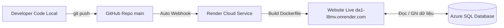

# 🎣 FuuFishing - Website Thương Mại Điện Tử Đồ Câu Cá

Website thương mại điện tử chuyên nghiệp cung cấp thiết bị và phụ kiện câu cá (cần câu, mồi câu, dây câu, phụ kiện...), được phát triển trên nền tảng **ASP.NET Core (.NET 10)** kết hợp kiến trúc MVC và RESTful Web API.

🌐 **Website Trực Tuyến (Production):** [https://da1-l8mv.onrender.com/](https://da1-l8mv.onrender.com/)

---

## 📌 1. Các Đường Dẫn Nhanh Của Hệ Thống

| Chức năng | Đường dẫn trên Web Online | Đường dẫn trên Local |
|---|---|---|
| 🏠 **Trang chủ** | [da1-l8mv.onrender.com](https://da1-l8mv.onrender.com/) | `http://localhost:5198/` |
| 🛍️ **Cửa hàng (Shop)** | [da1-l8mv.onrender.com/shop](https://da1-l8mv.onrender.com/shop) | `http://localhost:5198/shop` |
| 🛒 **Giỏ hàng** | [da1-l8mv.onrender.com/cart](https://da1-l8mv.onrender.com/cart) | `http://localhost:5198/cart` |
| 🔐 **Đăng nhập Admin** | [da1-l8mv.onrender.com/admin/login](https://da1-l8mv.onrender.com/admin/login) | `http://localhost:5198/admin/login` |
| 📊 **Trang Quản trị (Dashboard)** | [da1-l8mv.onrender.com/admin](https://da1-l8mv.onrender.com/admin) | `http://localhost:5198/admin` |
| 📦 **Quản lý Sản phẩm** | [da1-l8mv.onrender.com/admin/products](https://da1-l8mv.onrender.com/admin/products) | `http://localhost:5198/admin/products` |
| 🗂️ **Quản lý Danh mục** | [da1-l8mv.onrender.com/admin/categories](https://da1-l8mv.onrender.com/admin/categories) | `http://localhost:5198/admin/categories` |
| 📑 **Quản lý Đơn hàng** | [da1-l8mv.onrender.com/admin/orders](https://da1-l8mv.onrender.com/admin/orders) | `http://localhost:5198/admin/orders` |

---

## 🔑 2. Tài Khoản Quản Trị (Admin) Mặc Định

Tài khoản dùng để đăng nhập vào trang quản trị trên cả Web Online và Local:

- **Đường dẫn:** [https://da1-l8mv.onrender.com/admin/login](https://da1-l8mv.onrender.com/admin/login)
- **Email:** `admin@gmail.com`
- **Mật khẩu:** `Admin@123`

---

## 🚀 3. Hướng Dẫn Dành Cho Đồng Đội (Chạy Local Để Code)

Dự án **đã được cấu hình kết nối sẵn đến Azure Cloud SQL Database**. Thành viên trong nhóm khi tham gia **KHÔNG cần phải cài đặt SQL Server hay SSMS**, chỉ cần làm 2 bước sau:

### Bước 1: Clone dự án về máy tính
Mở Terminal / PowerShell và gõ:
```powershell
git clone https://github.com/LIKYWAY3/DA1.git
cd DA1
```

### Bước 2: Chạy ứng dụng
```powershell
dotnet run --project ASPtestShop
```
Ứng dụng sẽ tự động tải các thư viện cần thiết, kết nối trực tiếp vào cơ sở dữ liệu đám mây và mở cổng lắng nghe tại `http://localhost:5198` hoặc `https://localhost:7198`. Bạn mở trình duyệt lên là có thể bắt đầu code ngay!

---

## 📖 4. Hướng Dẫn Sử Dụng Chi Tiết

### A. Dành Cho Khách Hàng (Người Mua Hàng)
1. **Xem và tìm kiếm sản phẩm:**
   - Truy cập vào trang [Cửa hàng (Shop)](https://da1-l8mv.onrender.com/shop).
   - Lọc sản phẩm theo từng danh mục (Cần câu, Mồi câu, Dây câu, Phụ kiện...).
   - Bấm vào từng sản phẩm để xem ảnh chi tiết, giá gốc, giá khuyến mãi và thông số kỹ thuật.
2. **Mua hàng & Đặt hàng:**
   - Nhấn **Thêm vào giỏ hàng** tại sản phẩm bạn muốn mua.
   - Vào [Giỏ hàng](https://da1-l8mv.onrender.com/cart) để xem lại danh sách, tăng/giảm số lượng hoặc xóa sản phẩm.
   - Bấm **Tiến hành đặt hàng (Checkout)**, điền họ tên, số điện thoại, địa chỉ nhận hàng và chọn phương thức thanh toán (COD).
   - Bấm **Xác nhận đặt hàng** ➔ Hệ thống tạo mã đơn hàng thành công.

### B. Dành Cho Quản Trị Viên (Admin)
1. **Đăng nhập quản trị:**
   - Vào link [/admin/login](https://da1-l8mv.onrender.com/admin/login) ➔ Điền `admin@gmail.com` / `Admin@123`.
2. **Quản lý Sản phẩm (`/admin/products`):**
   - **Thêm sản phẩm mới:** Bấm nút *Thêm sản phẩm*, nhập tên, danh mục, giá tiền, giá sale, số lượng kho, mô tả và tải ảnh sản phẩm trực tiếp từ máy lên.
   - **Chỉnh sửa sản phẩm:** Bấm nút *Sửa* tại sản phẩm cần cập nhật thông tin.
   - **Ghim nổi bật:** Tích chọn *Sản phẩm nổi bật (Featured)* để đưa sản phẩm xuất hiện ở trang chủ.
   - **Xóa sản phẩm:** Bấm *Xóa* để ẩn hoặc gỡ sản phẩm khỏi danh mục bán.
3. **Quản lý Danh mục (`/admin/categories`):**
   - Thêm các nhóm hàng mới (ví dụ: *Cần câu Lure, Mồi mềm, Dây PE...*).
   - Tạo danh mục cha - con để phân cấp menu dễ nhìn.
4. **Quản lý Đơn hàng (`/admin/orders`):**
   - Xem toàn bộ danh sách khách đặt hàng mới nhất kèm số điện thoại, địa chỉ và tổng tiền.
   - Nhấp vào xem chi tiết đơn để thấy từng món hàng khách đã mua.
   - Cập nhật trạng thái đơn: *Chờ xử lý (Pending)* ➔ *Đang giao hàng (Shipping)* ➔ *Đã hoàn thành (Delivered)* hoặc *Đã hủy (Cancelled)*.

---

## 🔄 5. Quy Trình Phát Triển & Triển Khai (CI/CD Workflow)

Quy trình tự động hóa đã được thiết lập giữa **GitHub ➔ Render ➔ Azure SQL**:



1. **Code tính năng trên máy tính:** Kiểm tra chạy thử tại `localhost:5198`.
2. **Đẩy code lên GitHub:**
   ```powershell
   git add .
   git commit -m "Mô tả tính năng bạn vừa thêm"
   git push origin main
   ```
3. **Render tự động cập nhật:** 
   - Render nhận được code mới từ GitHub và tự động build lại Docker container.
   - Sau 1 - 2 phút, website online [https://da1-l8mv.onrender.com/](https://da1-l8mv.onrender.com/) sẽ có ngay tính năng mới mà toàn bộ dữ liệu trên Azure không hề bị ảnh hưởng.

---

## 🛠️ 6. Công Nghệ & Hạ Tầng

- **Ngôn ngữ & Nền tảng:** C# (.NET 10.0), ASP.NET Core MVC, Web API
- **Cơ sở dữ liệu:** Microsoft SQL Server (Lưu trữ trên Microsoft Azure SQL Serverless)
- **Truy xuất dữ liệu:** Entity Framework Core 10 (Code-First Migrations)
- **Bảo mật:** ASP.NET Core Identity (Role-based Authorization: Admin & Customer), JWT Token
- **Hạ tầng triển khai:**
  - **Docker Container:** Đóng gói ứng dụng trên nền Linux Alpine / Debian với .NET Runtime 10.
  - **Hosting Web:** Render Cloud Platform.
  - **Hosting Database:** Microsoft Azure SQL Database (Khu vực East Asia).

---

## 📁 7. Cấu Trúc Thư Mục Dự Án

```text
├── ASPtestShop/
│   ├── Controllers/          # Xử lý Controller (MVC Admin & API khách hàng)
│   ├── Models/               # Entity Data Models, ViewModels & DTOs
│   ├── Services/             # Xử lý nghiệp vụ (Product, Category, Auth, Order, Upload...)
│   ├── Views/                # Giao diện Razor Pages (Shop, Cart, Order, Admin...)
│   ├── wwwroot/              # File tĩnh (CSS, JS, Fonts, hình ảnh, Uploads)
│   ├── Program.cs            # Khởi tạo DI, Middleware, Cổng lắng nghe & Pipeline
│   └── appsettings.json      # File cấu hình chuỗi kết nối và JWT
├── Dockerfile                # File cấu hình đóng gói container chạy trên Render (.NET 10)
├── .dockerignore             # Loại bỏ các file rác khi build Docker
├── hshop_clean.sql           # File script SQL sao lưu dữ liệu sạch (24 danh mục + 100 sản phẩm mẫu)
└── README.md                 # Tài liệu hướng dẫn sử dụng và triển khai dự án
```

---

## ⚠️ 8. Các Lưu Ý Quan Trọng
- **Không xóa file `Dockerfile` và `.dockerignore`**: Render phụ thuộc vào 2 file này để build môi trường .NET 10.
- **Dữ liệu được lưu trên đám mây Azure**: Khi bạn thêm sản phẩm trên máy local hay trên web Render thì cả hai đều dùng chung cơ sở dữ liệu trên Azure.
- **Website Render Free**: Nếu sau 15 phút không có người truy cập, Render sẽ tạm thời đưa web vào trạng thái "ngủ đông". Khi có người click vào link, web sẽ mất khoảng 30 - 40 giây ở lần tải đầu tiên để khởi động lại.
